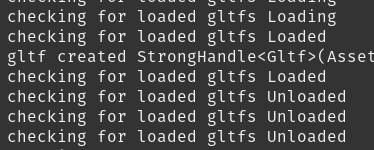

# bevy gltf unloading issue

- this is a barebone reproduction of an issue with certain gltf files becoming unloaded as soon as they are loaded, despite having a strong handle stored in a resource




- no yet clear why some files work and some others don't
- run this with 
```rust cargo run --features bevy/dynamic_linking```


# assets:
- missiletower1_building003.glb : https://sketchfab.com/3d-models/missiletower1-building003-20de54c68e3d4f3cb0bb7bdc69ac6c36 by [Christian Rudorff](https://sketchfab.com/ChristianRudorff)  CC License with atribution
- wheelbot.glb : my own creation, not licensed , for demo purposes only